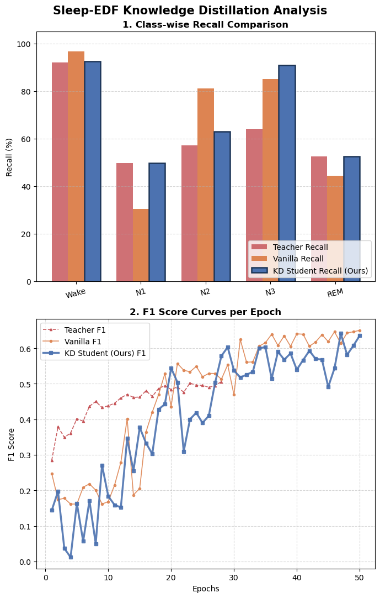

# 😴 SleepEDF-KD-Project: Knowledge Distillation-Based 2-Channel Sleep Stage Classification

[](https://www.python.org/)
[](https://pytorch.org/)
[](LICENSE)

> **A lightweight, high-efficiency sleep staging framework using 2-channel biosignals (EEG + EMG). Combines Sub-linear Hybrid Re-balancing to mitigate extreme class imbalance with Knowledge Distillation (KD) for 85% model compression without sacrificing minority-stage recall.**

---

## 1. Overview

Automated Sleep Stage Classification (SSSC) is essential for sleep disorder diagnosis and long-term monitoring. This project leverages the **Sleep-EDF** dataset and a minimal **2-channel setup (EEG + EMG)** to classify 5 sleep stages: **Wake (W), N1, N2, N3, and REM**.

### Key Objectives

1. **Minimal-Channel Efficiency:** Streamline full Polysomnography (PSG) down to just **2 channels (EEG + EMG)** for compact, wearable, and edge-device integration.
2. **Sub-linear Hybrid Re-balancing:** Address severe class imbalance (N1/REM scarcity) using a combined **SQRT-Inverse Sampler ($n=0.5$)** and **SQRT-Inverse Weighted Loss (Hard & Soft targets)**.
3. **Knowledge Distillation (KD):** Transfer "Knowledge from a high-capacity 1D CNN + Transformer Teacher to a GroupNorm-based 1D CNN Student.

---

## 2. Methodology & Architecture

### 2.1. Model Architecture

* **Teacher Model ($8.66\text{MB}$, Frozen):** 
  * 7-Channel Full PSG Input $\rightarrow$ 1D CNN Feature Extractor $\rightarrow$ Positional Encoding $\rightarrow$ Transformer Encoder (4 Layers, 8 Heads) $\rightarrow$ Unweighted Soft Logits.
* **Student Model ($1.29\text{MB}$, Trainable):** 
  * 2-Channel Input (EEG + Submental EMG) $\rightarrow$ 1D CNN Extractor $\rightarrow$ **GroupNormalization ($G=2$)** $\rightarrow$ **ELU Activation** $\rightarrow$ Linear Classifier.

### 2.2. Custom Knowledge Distillation Pipeline

$$\mathcal{L}_{\text{Total}} = \alpha \cdot \mathcal{L}_{\text{Soft}}(\text{KL Div, } T=1.5, \mathbf{w}_{\text{SQRT}}) + (1-\alpha) \cdot \mathcal{L}_{\text{Hard}}(\text{Weighted CE}, \mathbf{w}_{\text{SQRT}})$$

* **Soft Target Loss ($\alpha = 0.15, T = 1.5$):** Transfers smooth inter-class probability relationships from the Teacher.
* **Hard Target Loss ($1 - \alpha = 0.85$):** Ensures ground-truth label alignment.
* **Sub-linear Weights ($\mathbf{w}_{\text{SQRT}} \propto 1/\sqrt{N_c}$):** Balanced pressure prevents majority class precision degradation while boosting minority recall.

---

## 3. Experimental Results (Trial 07)

<p align="center">
  
</p>

### 3.1. Performance & Model Size Comparison

| Model | Channels | Size (MB) | Compression | Macro F1 | Key Highlights |
| :--- | :---: | :---: | :---: | :---: | :--- |
| **Teacher (Transformer)** | 7 Ch | 8.66 MB | Base (1.0x) | 0.5912 | Unweighted training for unbiased soft target generation |
| **Vanilla Student (1D CNN)** | 2 Ch | 1.29 MB | 85.1% ↓ | 0.6659 | Biased towards majority classes (N1 Recall dropped to 30.3%) |
| **KD Student (Ours)** | **2 Ch** | **1.29 MB** | **85.1% ↓** | **0.6414** | **Restores minority stage recall with optimal balance** |

### 3.2. Class-Wise Recall Benchmark (%)

| Sleep Stage | Teacher Recall | Vanilla Student Recall | **KD Student Recall (Ours)** | **KD vs Vanilla Improvement** |
| :--- | :---: | :---: | :---: | :---: |
| **Wake** | 91.98% | 96.65% | **92.53%** | Preserved baseline |
| **N1 (Minority)** | 49.66% | 30.34% | **49.66%** | **$+19.32\%$p (100% Teacher Restoration)** |
| **N2** | 57.22% | 81.01% | **62.91%** | Balanced boundary |
| **N3** | 64.16% | 84.98% | **90.79%** | **$+5.81\%$p (Best Performance)** |
| **REM (Minority)** | 52.61% | 44.44% | **52.61%** | **$+8.17\%$p (100% Teacher Restoration)** |

---

## 4. Pipeline Automation & Monitoring

The automated training and evaluation pipeline is executed sequentially:

```bash
# Sequential automated execution via terminal or Jupyter notebook
jupyter nbconvert --to notebook --execute sleepedf-baseline-learning.ipynb --output sleepedf-baseline-learning-out.ipynb
jupyter nbconvert --to notebook --execute sleepedf-kd-2ch.ipynb --output sleepedf-kd-2ch-out.ipynb